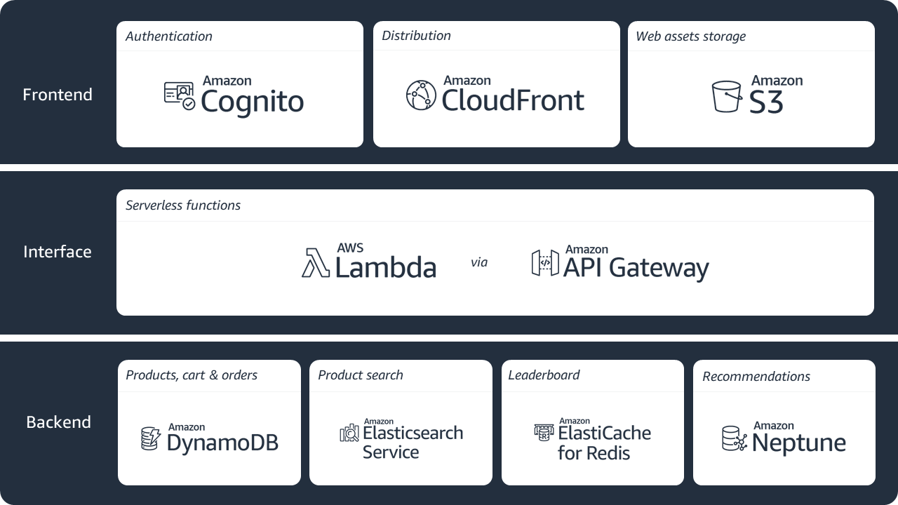
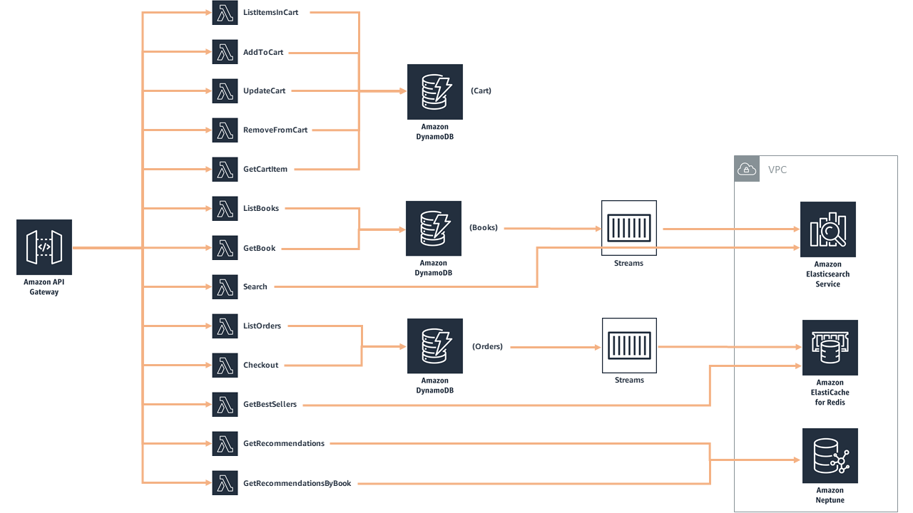
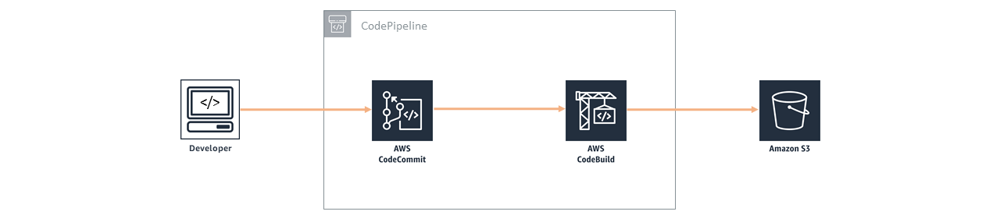

## AWS Powered Online Bookstore 
TEAM : Serverless Seekers 
1) Nitya Reddy Yerram
2) Dhruv Khut
3) Pratik Kamanahalli Mallikarjuna
4) Rahul Dhingra

The AWS Bookstore Demo Application is a cloud-native, serverless web application simulating an online bookstore. It allows users to browse, search, view product details, add items to a cart, and place orders. The application integrates multiple AWS services to demonstrate scalability, high availability, and a cost-effective cloud architecture.. **[Try out the deployed application here](https://d2h3ljlsmzojxz.cloudfront.net/)**!

You can browse and search for books, look at recommendations and best sellers, manage your cart, checkout, view your orders, and more.  Get started with building your own below!
&nbsp;
&nbsp;
## Outline

Key Features
1) User authentication and authorization
2) Browse and search books
3) Add books to shopping cart
4) Place orders with order history
5) Fully serverless and event-driven architecture
6) Continuous integration and deployment (CI/CD) using AWS CodePipeline

&nbsp;

## Architecture Diagram 
**High-level, end-to-end diagram**

The architecture diagram above illustrates the overall structure of the AWS Bookstore Demo Application. It shows how key AWS services are integrated to form a serverless, event-driven system. The frontend, hosted on Amazon S3 and delivered via CloudFront, interacts with backend APIs exposed through Amazon API Gateway. User authentication is handled by Amazon Cognito, while business logic is processed by AWS Lambda functions. Data is stored across purpose-built databases including DynamoDB, Elasticsearch, ElastiCache, and Neptune. This architecture enables high scalability, fault tolerance, and seamless integration of all application components without requiring manual server management.

## AWS Services Used

| Component            | AWS Service                     | Purpose                                      |
|--------------------|--------------------------------|---------------------------------------------|
| Frontend Hosting     | Amazon S3 + CloudFront          | Hosts and delivers frontend content          |
| Authentication      | Amazon Cognito                  | Manages user authentication                 |
| API Management       | Amazon API Gateway             | Routes API requests                          |
| Business Logic       | AWS Lambda                     | Handles backend logic                        |
| Database             | Amazon DynamoDB                | Stores books, cart, orders                   |
| Search Engine        | Amazon Elasticsearch Service   | Enables full-text search                     |
| Caching              | Amazon ElastiCache (Redis)     | Speeds up frequently accessed data          |
| Recommendation       | Amazon Neptune                 | Manages graph-based recommendations         |
| CI/CD                | CodePipeline, CodeBuild        | Automates deployment                         |

Each AWS service in the application plays a critical role in delivering a fully serverless, scalable, and reliable online bookstore. By combining managed services for frontend hosting, authentication, API management, backend processing, data storage, caching, and search, the system minimizes operational overhead while ensuring high availability and low latency. This architecture allows the application to automatically scale based on demand, provides secure user access, and simplifies maintenance through automated deployment and monitoring.

&nbsp;
## Instructions

- **Frontend:** Static website hosted on S3 and distributed via CloudFront
- **Authentication:** Handled by Cognito with user pools and tokens
- **Backend:** Business logic implemented with AWS Lambda, exposed via API Gateway
- **Database:** DynamoDB for data storage
- **Search:** Elasticsearch for search functionality
- **Caching:** Redis (ElastiCache) for caching frequently accessed data
- **Recommendation:** Neptune for managing recommendations
- **CI/CD:** Automated deployment with CodePipeline and CloudFormation templates

&nbsp;

## Getting started

To set up the AWS Bookstore Demo App in your own AWS account, follow these steps:

1. Log in to the AWS Management Console if you haven’t already.
2. Launch the CloudFormation stack for your preferred AWS region. Select the “Launch Stack” option to open CloudFormation.
3. Go through the CloudFormation setup:
   - Enter a stack name, such as MyBookstore.
   - Enter a project name (use lowercase letters and keep it under 12 characters). This name will be used in naming resources like tables and search domains.
   - Review the settings and make sure the option to create necessary IAM roles is selected.
4. Click “Create Stack” to begin the deployment. This may take around 20–30 minutes to complete.
5. Once the stack is successfully created, check the CloudFormation outputs for the CloudFront URL.
6. Open the CloudFront URL in your web browser to access the application.
7. Create an account by signing up with your email and password. This will store your credentials in Amazon Cognito.
8. After signing up, you’ll receive a verification code by email. Enter this code to complete registration and sign in to the app.

**Note:** This is a demo application. Avoid using the same email and password you use for other important accounts.

&nbsp;

### Cleaning up

To tear down your application and remove all resources associated with AWS Bookstore Demo App, follow these steps:

1. Log into the [Amazon S3 Console](https://console.aws.amazon.com/s3) and  delete the buckets created for the demo app.  
   - There should be two buckets created for AWS Bookstore Demo App.  The buckets will be titled "X" and "X-pipeline", where "X" is the name you specified in the CloudFormation wizard under the AssetsBucketName parameter.  
   - *Note: Please be **very careful** to only delete the buckets associated with this app that you are absolutely sure you want to delete.*
2. Log into the AWS CloudFormation Console and find the stack you created for the demo app
3. Delete the stack

*Remember to shut down/remove all related resources once you are finished to avoid ongoing charges to your AWS account.*

&nbsp;

## Summary Diagram

&nbsp;

**Frontend**

Build artifacts are stored in a S3 bucket where web application assets are maintained (like book cover photos, web graphics, etc.). Amazon CloudFront caches the frontend content from S3, presenting the application to the user via a CloudFront distribution.  The frontend interacts with Amazon Cognito and Amazon API Gateway only.  Amazon Cognito is used for all authentication requests, whereas API Gateway (and Lambda) is used for all API calls interacting across DynamoDB, Elasticsearch, ElastiCache, and Neptune. 

**Backend**

The core of the backend infrastructure consists of Amazon Cognito, Amazon DynamoDB, AWS Lambda, and Amazon API Gateway. The application leverages Amazon Cognito for user authentication, and Amazon DynamoDB to store all of the data for books, orders, and the checkout cart. As books and orders are added, Amazon DynamoDB Streams push updates to AWS Lambda functions that update the Amazon Elasticsearch cluster and Amazon ElasticCache for Redis cluster.  Amazon Elasticsearch powers search functionality for books, and Amazon Neptune stores information on a user's social graph and book purchases to power recommendations. Amazon ElasticCache for Redis powers the books leaderboard. 

&nbsp;

**Developer Tools**

The code is hosted in AWS CodeCommit. AWS CodePipeline builds the web application using AWS CodeBuild. After successfully building, CodeBuild copies the build artifacts into a S3 bucket where the web application assets are maintained (like book cover photos, web graphics, etc.). Along with uploading to Amazon S3, CodeBuild invalidates the cache so users always see the latest experience when accessing the storefront through the Amazon CloudFront distribution.  AWS CodeCommit. AWS CodePipeline, and AWS CodeBuild are used in the deployment and update processes only, not while the application is in a steady-state of use.

&nbsp;

---

&nbsp;

## Challenges and Solutions
1) API Gateway + Cognito integration issues → Solved by correcting User Pool IDs and testing tokens
2) Lambda timeout errors → Increased timeout settings and optimized queries
3) CloudFront caching stale content → Implemented cache invalidation and filename versioning
4) Elasticsearch index refresh delay → Triggered updates via DynamoDB Streams to Elasticsearch
5) CI/CD failures → Added missing environment variables and permissions in CodeBuild role

&nbsp;
## Future Work
1) Integrate payment gateway (Stripe, Amazon Pay)
2) Add user reviews and ratings
3) Build an admin panel for inventory management
4) Expand recommendation engine with ML (Amazon Personalize)
5) Develop mobile app version using AWS Amplify
6) Enhance monitoring with AWS X-Ray and CloudWatch Alarms

